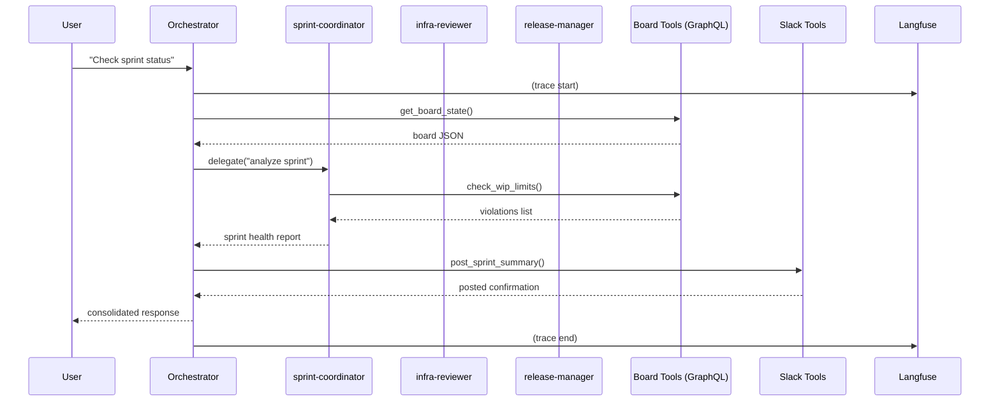

# Hyfe DevOps Agent

A DevOps workflow coordinator for the Hyfe ecosystem. It orchestrates specialized subagents to track sprint health, review infrastructure changes, and coordinate releases, while surfacing board data and Slack updates through a single conversational interface.

## Architecture

The orchestrator receives a DevOps question, gathers context from GitHub Projects, delegates analysis to the appropriate subagent, and optionally posts a summary or poll to Slack. All tool calls and subagent delegations are traced with Langfuse.



## Subagents

| Subagent | Role | Scoped Tools |
|----------|------|--------------|
| `sprint-coordinator` | Analyzes sprint and board health, WIP violations, blocked tickets, subtask completion, and velocity trends. | `get_board_state`, `check_wip_limits`, `list_blocked_tickets`, `parse_subtasks`, `get_sprint_velocity` |
| `infra-reviewer` | Performs read-only reviews of Terraform plans, Helm values, CI/CD configs, and Kubernetes manifests. | None (pure reasoning) |
| `release-manager` | Assesses release readiness from open issues, subtask completion, blocking PRs, and CI status. | `get_board_state`, `parse_subtasks`, `send_notification` |

Write tools (`move_ticket`, `create_subtask`) and Slack vote tools (`create_slack_vote`, `evaluate_slack_vote`) are reserved for the orchestrator only.

## Tools

### Board tools (`tools/board_tools.py`)

| Tool | Required parameters | Description |
|------|---------------------|-------------|
| `get_board_state` | `project_number`, `org`, `max_in_scope`, `max_in_progress` | Returns the current state of a GitHub Projects v2 board grouped by status with WIP violations. |
| `move_ticket` | `issue_number`, `target_status`, `project_number`, `org`, `repo` | Moves a GitHub issue to a target status column in a Projects v2 board. |
| `check_wip_limits` | `project_number`, `org`, `max_in_scope`, `max_in_progress` | Checks whether the board exceeds configured advisory WIP limits. |
| `list_blocked_tickets` | `project_number`, `org` | Returns project items that appear blocked by status, label, or title prefix. |
| `parse_subtasks` | `issue_number`, `org`, `repo` | Parses checklist subtasks and linked sub-issues for a GitHub issue. |
| `create_subtask` | `parent_issue_number`, `title`, `org`, `repo`, `body` | Creates a new subtask issue and links it to a parent GitHub issue. |
| `get_sprint_velocity` | `org`, `repo`, `project_number`, `sprint_count` | Computes recent sprint velocity from closed project items and subtask completion rates. |

### Slack tools (`tools/slack_tools.py`)

| Tool | Required parameters | Description |
|------|---------------------|-------------|
| `send_notification` | `channel`, `message` | Posts a plain-text notification to a Slack channel. |
| `post_sprint_summary` | `channel`, `summary` | Posts a formatted sprint summary block to a Slack channel. |
| `create_slack_vote` | `question`, `options`, `channel` | Creates an emoji-based poll in a Slack channel and returns the message timestamp. |
| `evaluate_slack_vote` | `channel`, `message_ts`, `options` | Evaluates an emoji-based poll, counting votes per option with tie detection. |

## Configuration

Copy `.env.example` to `.env` and set the following variables:

| Variable | Description |
|----------|-------------|
| `ZAI_API_KEY` | Z.AI API key for the GLM coding plan endpoint. |
| `GITHUB_TOKEN` | GitHub personal access token with `repo` and `project` scopes. |
| `GITHUB_PROJECT_NUMBER` | Default GitHub Projects v2 board number. |
| `GITHUB_ORG` | Default GitHub organization login for board operations. |
| `GITHUB_REPO` | Default repository name for ticket and subtask operations. |
| `SLACK_BOT_TOKEN` | Slack bot token with `chat:write`, `reactions:write`, and `reactions:read` scopes. |
| `SLACK_DEFAULT_CHANNEL` | Default Slack channel ID or name for notifications and votes. |
| `BOARD_MAX_IN_SCOPE` | Advisory WIP limit for in-scope/todo/backlog items. |
| `BOARD_MAX_IN_PROGRESS` | Advisory WIP limit for in-progress items. |
| `LANGFUSE_PUBLIC_KEY` | Langfuse public key for tracing. |
| `LANGFUSE_SECRET_KEY` | Langfuse secret key for tracing. |
| `LANGFUSE_HOST` | Langfuse host URL, e.g. `http://localhost:3000`. |

## Quickstart

Install dependencies and start the local LangGraph server:

```bash
cd examples/hyfe-devops-agent
cp .env.example .env
# Edit .env and add your API keys
uv sync
uv run langgraph dev --port 2024
```

The server will be available at `http://localhost:2024`.

## API Usage

Create a thread and stream a run using the LangGraph API:

```bash
THREAD_ID=$(curl -s -X POST http://localhost:2024/threads \
  -H "Content-Type: application/json" \
  -d '{}' | python3 -c "import sys, json; print(json.load(sys.stdin)['thread_id'])")

curl -s -X POST "http://localhost:2024/threads/${THREAD_ID}/runs/stream" \
  -H "Content-Type: application/json" \
  -d '{
    "assistant_id": "hyfe-devops-agent",
    "input": {
      "messages": [
        {"role": "user", "content": "What is the current sprint status?"}
      ]
    }
  }'
```

Replace `localhost` with `<your-server-ip>` if running on a remote host.

## UI Usage

Connect the running server to [deep-agents-ui](https://github.com/langchain-ai/deep-agents-ui):

```bash
git clone https://github.com/langchain-ai/deep-agents-ui.git
cd deep-agents-ui
yarn install
yarn dev
```

Open the UI, go to Settings, set the Assistant ID to `hyfe-devops-agent`, and point the deployment URL to `http://localhost:2024` (or `<your-server-ip>:2024`). You can then send DevOps questions through the chat interface.

### Testing

This project uses **DeepEval** for evaluation metrics and **Langfuse** for tracing — no LangSmith required.

All test infrastructure is under `tests/`:

| Directory | Contents | API Keys Needed |
|-----------|----------|-----------------|
| `tests/unit_tests/` | `GenericFakeChatModel` tests with stub tools | None |
| `tests/integration_tests/` | DeepEval evals with real LLM | `ZAI_API_KEY` |
| `tests/datasets/` | Synthetic golden dataset + integrity checks | `ZAI_API_KEY` (for generation) |

**Quickstart:**

```bash
# Unit tests — zero network I/O, zero API keys
uv sync --group test
uv run --group test pytest tests/unit_tests/ -v

# Integration evals — requires Z.AI GLM API key
ZAI_API_KEY=$KEY uv run --group test pytest tests/integration_tests/ -m eval -v

# Synthetic data integrity check
uv run --group test pytest tests/datasets/ -v

# Regenerate synthetic dataset
uv run --group test python tests/datasets/generate_synthetic.py --force

# Full CI gate
make test-hyfe-devops
```

**Test structure:**

- **Unit tests** (`tests/unit_tests/`) — Exercise the agent with `FixedGenericFakeChatModel` and 11 synchronous stub tools. The stubs replace real GitHub GraphQL and Slack Web API calls with deterministic JSON responses. Tests run instantly, require no credentials, and prove the agent selects and executes the correct tools for each query.
- **Integration evals** (`tests/integration_tests/`) — Run the agent with stub tools but a real `glm-4.5` model through the Z.AI programming endpoint. DeepEval verifies tool-correctness (did the agent call the expected tools?) and task completion. Tools are still stubbed — no real GitHub or Slack calls.
- **Synthetic datasets** (`tests/datasets/`) — Pre-generated `Golden` test cases covering sprint status, blocked tickets, release readiness, and Slack voting. The integrity check validates each golden has an input, expected output, and valid expected tool names matching the 11 stub tools.

**Adding a new test case:**

1. Add a new `Golden` to `tests/datasets/synthetic_goldens.json` with `input`, `expected_output`, and `expected_tools`.
2. Add a new test function in `tests/unit_tests/test_tool_selection.py` using `FixedGenericFakeChatModel` to script the expected tool calls.
3. Add a new eval in `tests/integration_tests/test_workflow_evals.py` with `@pytest.mark.eval`.
4. Run all tests: `make test-hyfe-devops`.
